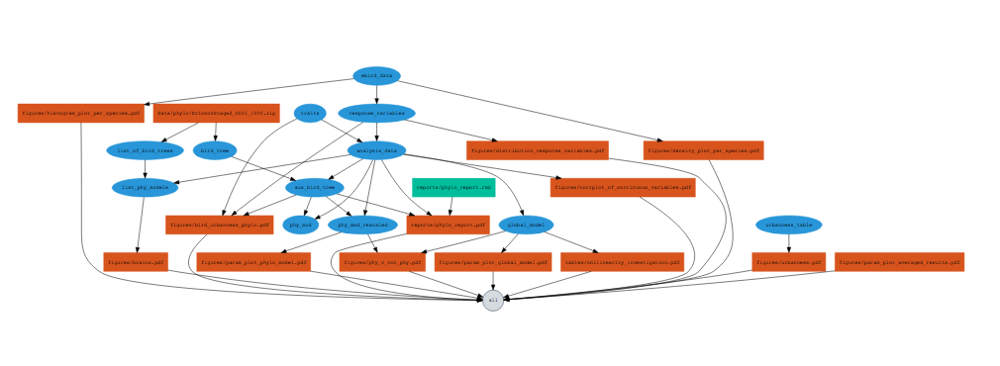

This repository contains code needed to reproduce the analysis for the article: Callaghan et al. 2019

## Instructions

### Install relevant software

All analyses were done in `R`. You need to download this repository, and then open an R session with working directory set to the root of the project.

To compile the paper, we use the [remake](https://github.com/richfitz/remake) package for R. You can install remake using the `devtools` package (run `install.packages("devtools")` to install devtools if needed):

```{r,eval=FALSE}
devtools::install_github("richfitz/remake", dependencies=TRUE)
devtools::install_github("liamrevell/phytools", dependencies=TRUE)
```

### Recreating the figures and paper

To generate all figures and analyses simply do:

```{r}
remake::make()
```

### Understanding the workflow of the analysis

Here is a figure that describes the workflow from the cannonical data files to the final figures and tables.  In the following figure, internal data steps (intermediate files) are shown in blue and the final outputs are shown in red.  Each arrow is performed by a function written in R and contained in this repository.  

```{r,eval=FALSE}
remake::diagram(remake::make())
```


